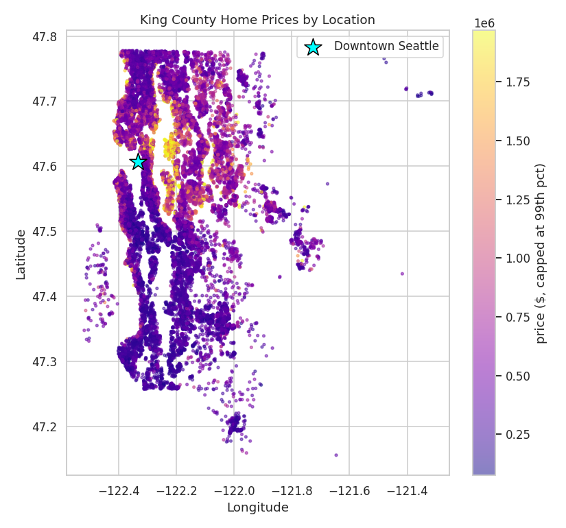

# What Drives the Price of a Home? Separating the House from the Neighborhood

**Author:** Neda Nadjmabadi

## Executive summary

This project looks at what actually sets the sale price of a home, and splits that price into two parts: the house itself (size, quality, condition) and the location around it (how close it is to the city, and which ZIP code it sits in). Using about 21,000 real home sales from King County, Washington, I cleaned the data, explored it visually, engineered a set of features including a distance-to-downtown measure, and built a baseline regression model. The model predicts sale price with a typical error of roughly $185,000 and explains about 75% of the variation in price, more than cutting the error of a naive guess in half. The clearest takeaway is that location is a primary driver of price, on par with the size and quality of the house, which changes how a seller should think about spending money before a sale.

## Rationale

The person this helps most is someone trying to sell an older home. They face a pile of decisions with real money attached and no clear way to rank them. Do you redo the kitchen or just refresh it? Is finishing the basement worth it, or is that thousands of dollars you will never see again? Most sellers answer these questions on gut feeling, or they trust a contractor whose incentive is to sell them more work. If nobody answers this clearly, people keep over-improving in the wrong places and pricing off vibes instead of evidence. Separating the price that comes from the house from the price that comes from the neighborhood tells an owner where a renovation budget actually pays back, and where it does not.

## Research Question

Which features of a home, and which qualities of its location, have the biggest effect on its sale price, and how accurately can we predict what a house will sell for once we account for both?

## Data Sources

King County, WA home sales (May 2014 to May 2015), about 21,000 sold homes with roughly 20 fields each. Every row is one sale and includes the physical attributes of the home (living area, lot size, bedrooms, bathrooms, floors, construction grade, condition, year built, year renovated, basement, waterfront, view) plus its location (ZIP code, latitude, longitude) and the final sale price. The dataset is a widely used public housing dataset and arrived with no missing values. A copy is stored in [`data/kc_house_data.csv`](data/kc_house_data.csv).

Note on the change since Module 16: the original proposal named the Ames housing dataset. I moved to the King County data because it includes latitude, longitude, and ZIP code, which are exactly the location and demand signals the research question asks about. The standard Ames dataset does not carry those geographic fields, so it could not support the location side of the analysis.

## Methodology

The project follows the CRISP-DM stages. After cleaning (parsing dates, removing homes that sold twice, and dropping a small number of impossible records such as a 33-bedroom data-entry error), I engineered features that express the research question directly: age at sale, a renovation flag, a basement flag, and a straight-line distance from each home to downtown Seattle as a proxy for proximity to the city. Exploratory analysis used histograms, a correlation heatmap, scatter plots, and a map of prices by latitude and longitude.

For modeling I predict the log of price so that errors read as percentages and the skew is controlled, then convert predictions back to dollars. I fit an ordinary linear regression as the baseline, then Ridge and Lasso regression, each tuned with 5-fold cross-validation and grid search over the penalty strength, all inside a pipeline with feature scaling. The headline evaluation metric is RMSE in dollars, chosen because the audience thinks in dollars and RMSE penalizes the large misses that matter most on a purchase this size. MAE and R² are reported alongside for context.

## Results

The baseline model predicts sale price with an RMSE of about $185,000 and an MAE of about $113,000, against a naive mean-guess error of roughly $391,000, and it explains about 75% of the variation in log price.

Three findings stand out. First, location is a primary driver of price, not a footnote: distance to downtown Seattle is the single strongest predictor in the model, and median prices vary about 8x between the cheapest and most expensive ZIP codes. Second, on the house side, size and construction grade dominate, while bathrooms, view, and waterfront add real but smaller amounts, and bedroom count and having a basement add almost nothing once size and grade are known. Third, Ridge and Lasso barely changed the accuracy compared to plain linear regression, which tells us the baseline is not overfit and the signal is carried by a handful of strong, mostly independent features rather than many weak ones.

For a seller, the practical message is that much of a home's price is set by where it sits, which no renovation can change. The features an owner can influence and that actually move price are the ones tied to usable space and finish quality, not bedroom count or a finished basement on its own.

## Next steps

Add a ZIP-level demand feature (median price per ZIP, computed on training data only to avoid leakage) to capture neighborhood effects the single distance measure misses. Try non-linear models such as Random Forest and Gradient Boosting and compare them to this baseline on the same RMSE metric. Translate the coefficients into a plain "what pays back" ranking for renovations, with dollar estimates. Finally, test the approach on a second housing market to see how well it transfers.

## Outline of project

- [Notebook: Data cleaning, EDA, feature engineering, and baseline modeling](notebooks/capstone_eda.ipynb)

## Contact and Further Information

Neda Nadjmabadi
